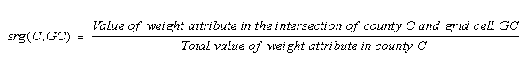
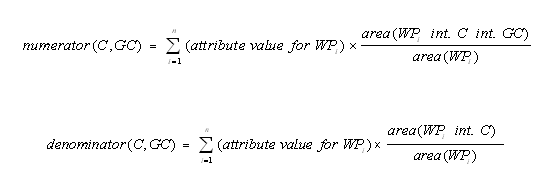
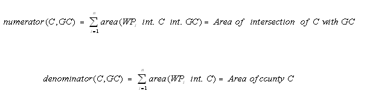

Surrogate Tools DB User's Guide
==

Surrogate Tools DB is a set of tools to generate spatial surrogates that are inputs to emission models such as the Sparse Matrix Operator Kernel Emissions (SMOKE) modeling system. Surrogate Tools DB consists of Java programs that use a spatial database (e.g. Postgres with PostGIS), along with some helper shell scripts. The package includes utilities for merging and gapfilling spatial surrogates, and helps simplify the process of generating surrogates. For each surrogate it calculates, Surrogate Tools DB generates metadata that includes the shapefiles and attributes used in the computations, whether other surrogates were merged together in the process, and which surrogates were used for gapfilling.

Surrogate Tools DB can generate surrogates for point-, line-, or polygon-based weight shapefiles such as ports, airports, housing, population, agriculture, water area, and railroads. As of version 1.0, the package supports regularly spaced air quality model grids on a variety of map projections, such as Universal Transverse Mercator (UTM), Lambert Conformal, and latitude-longitude. Support for the WRF/NMM-CMAQ E-grids (rotated diamond shaped grids) or generic modeling polygon shapes (such as census tracts) is planned for the future.

Surrogate Tools DB is controlled by Comma Separated Value (CSV) configuration files, to complete the following tasks:
-   compute surrogates from shapefiles
-   merge together existing surrogate data
-   gapfill surrogates using data from other surrogates to ensure that entries are available for every single county
-   generate quality assurance summaries for all computed surrogates
-   normalize to ensure that the surrogate fractions for every county sum to 1.0 (except some counties on border, can be excluded).

The format of the configuration files allows them to be easily edited and maintained in a spreadsheet program like Microsoft Excel.

## Background on Shapefiles and Surrogates

### Shapefiles

Shapefiles contain geographic data objects in the forms of points, lines, or polygons with associated informational attributes that describe the geometric features. Shapefiles are a GIS industry standard format developed by the Environmental Systems Research Institute (ESRI) (see <http://www.esri.com/>). Shapefiles contain geospatial vector data and are the primary type of input data for Surrogate Tools DB.

Each shapefile stores data for a single feature class (i.e., a shapefile contains information for points, lines, or polygons). Point shapes are single-coordinate features such as smoke stacks, schools, or ports. Line shapes can be continuous lines, such as roads, and they can also be polylines, like the branches or tributaries of a river. Polygon shapes can be simple areas or multipart areas like states and countries (e.g., the state of Michigan is a multipart shape). Shapefiles do not store topological information in that they do not contain associations between points, lines and polygons.

A shapefile consists of a group of files that contain the coordinates of the shapes, associated attributes, and optionally, map projection information. Each shapefile contains three mandatory files:

- .shp – coordinates of shapes or features (points, lines, or polygons)

- .shx – shape positional index data, to support quickly searching through the data contained in the shapefile

- .dbf – attribute data (e.g., population counts, road classes, airport capacities) for each shape in dBASE III format.

A Shapefile can also contain many optional files, the details of which are not important to this discussion. The open source program [QGIS](http://www.qgis.org) and the industry standard program ESRI ArcMap can be used to view Shapefiles.

### Spatial Surrogates

Spatial surrogates are most commonly used to map county-level emissions data onto the rectangular grid cells used by an Eulerian air quality model such as the [Community Multiscale Air Quality (CMAQ) modeling system](http://www.epa.gov/cmaq). A spatial surrogate is a value greater than zero and less than or equal to one that specifies the fraction of the emissions in an area (usually a county) that should be allocated to a particular model grid cell. Many types of emission inventories contain data summed by county. Because the area of a given county may fall into several model grid cells, spatial surrogates must be used to indicate the fraction of the emissions for that county that is to be assigned to each grid cell that overlaps the county. Spatial surrogates typically must be computed for each grid to be modeled, unless the grid used is a fully aligned subset of a grid for which spatial surrogates are already available.

When surrogates are created, usually there is some type of geographic attribute that is used to "weight" the county emissions into grid cells in a manner that is more specific than a simple uniform spread over the county, which would not reflect the differences in emissions between cities, rural areas, ports, etc. For example, weights could be information about points that represent ports (e.g., berths); or the vehicle miles traveled on lines representing the locations of roads or railroads; or polygon-based weight attributes such as geographic area, population, number of households and land use categories. You can create spatial surrogates with Surrogate Tools DB from point-, line-, or polygon-based shapefiles that contain weight attribute information. A single surrogate (srg) value for county C and grid cell GC is expressed as:



where srg = surrogate, C = county, and GC = grid cell. Note that a surrogate does not have to be for a county; it could be for some other geographic region such as a state, province, nation, or census tract. These polygons are known in Surrogate Tools DB as the "data polygons".

Three types of surrogates can be created with Surrogate Tools DB: polygon-based, line-based, and point-based. Polygon-based surrogates use attribute information that is based on area (e.g., population in a census tract). The surrogate value is calculated as the ratio of the attribute value in the intersection of the county and the grid cell to the total value of the attribute in a specific "data polygon" (e.g., county, state, census tract). Examples of polygon-based weight attributes are area, population, number of households, and land use. The numerator (i.e., the value of the weight attribute in the intersection of the county C and grid cell GC) and the denominator (i.e., the total attribute value in the county or other data polygon) are calculated according to the following equations:



where srg=surrogate, C = county (or other data polygon), GC = grid cell, WP = weight polygon, int. = intersection of, i = weight polygon, and n = the number of weight polygons.

For line-based surrogates, the length of the linear weight feature (e.g., railroad, river, road) replaces area in the above equations. For point-based surrogates, instead of using area, the software will allocate a value of 1 if the weight point falls within the region of interest or a value of 0 (zero) if it does not. In some cases, no special weight attribute is desired. Instead, the surrogate is based purely on the area of the polygon, the length of the polyline, or the count of the points. In this case, the above equations simplify to the following:



Surrogate Tools DB generates surrogate files ready to be used in SMOKE. On each line after the header line, the values used by SMOKE are followed by a "!" and then by the numerator, denominator, and QA sum. The format of the surrogate file is described below.

|Line|Columns|Description|
|---|---|---|
|1|A|#GRID|
| |B|Grid name|
| |C|X origin in units of the projection|
| |D|Y origin in units of the projection|
| |E|X direction cell length in units of the projection|
| |F|Y direction cell length in units of the projection|
| |G|Number of columns|
| |H|Number of rows|
| |I|Number of boundary cells|
| |J|Projection types:|
| | |Latitude-Longitude: “LAT-LON” or “LATGRD3”|
| | |Lambert Conformal: “LAMBERT” or “LAMGRD3”|
| | |Universal Transverse Mercator: “UTM” or “UTMGRD3”|
| |K|Projection units|
| |L|Projection alpha value|
| |M|Projection beta value|
| |N|Projection gamma value|
| |O|X direction projection center in units of the projection|
| |P|Y direction projection center in units of the projection|
|2|A|#SRGDESC=|
| |B|Surrogate code|
| |C|Surrogate name|
|Remaining comment lines|A|#[Surrogate Generation Variable] =
| |B|Value|
|Remaining lines|A|Spatial Surrogates code|
| |B|Country/State/County Code|
| |C|Grid column number|
| |D|Grid row number|
| |E|Spatial surrogate ratio|

## Input Files

The input files used by Surrogate Tools DB are five comma-separated-value (.CSV) files and a grid description file. Each CSV file is a tabular file that requires a specific set of columns. The title of each column describes the meaning of the data in the column and also notifies the program of the contents of the column. These CSV files can easily be viewed and edited by any spreadsheet software. Examples of each of the input files are provided in the Surrogate Tools DB package and can be customized to meet your needs. Detailed descriptions of each of the input files are in the subsections of this section. The high-level descriptions of the input files are as follows:

- `control_variables_pg.csv` - specifies information common to the generation of all surrogates (e.g., output directory, output grid, and names of the other input files).
- `shapefile_catalog_pg.csv` - provides the database table names for the shapefiles to be used during surrogate generation.
- `surrogate_specification_pg.csv` - provides information needed to generate each surrogate, including the input shapefiles or previously computed surrogates, weight attributes or merge functions to use, shapefile filter selections to apply, and how the surrogates should be gap-filled.
- `surrogate_codes.csv` - provides surrogate names and codes that are used to map surrogate names to surrogate codes, which is needed during surrogate merging and gapfilling.
- `surrogate_generation_pg.csv` - specifies the surrogates to create for a specific run of Surrogate Tools DB and whether to output quality assurance data for those surrogates (i.e., numerators, denominators, and sums of fractions for the county).

### Control Variables File

The *global control variables file* is a CSV file that specifies information that is common to the generation of all surrogates (e.g., output directory, output grid, and names of the other input files). A single global control variables file is used for each run of Surrogate Tools DB. The columns VARIABLE and VALUE are required. Any additional columns are optional and are ignored by Surrogate Tools DB. The following variables (listed in capital letters below) are recognized by Surrogate Tools DB in the global control variables file:

- `GENERATION CONTROL FILE` - directory and name of the generation control CSV file to use for the run.
- `SURROGATE SPECIFICATION FILE` - directory and name of the surrogate specification CSV file to use for the run.
- `SHAPEFILE CATALOG` - directory and name of the shapefile catalog CSV file to use for the run.
- `SURROGATE CODE FILE `- directory and name of the surrogate code CSV file to use for the run.
- `DEBUG_OUTPUT `- specifies whether srgcreate will output debugging information as it runs (specify Y for yes and N for no).
- `OUTPUT_FORMAT` - specifies the format for the output files (currently SMOKE is the only allowable value).
- `OUTPUT_FILE_TYPE` - specifies the type of output file to create (currently RegularGrid is the only allowable value).
- `OUTPUT_GRID_NAME` -  specifies the name of the output grid.
- `GRIDDESC` - specifies the directory and name of the grid description file.
- `OUTPUT DIRECTORY` - specifies the name of the directory into which the output surrogate files will be placed.
- `OUTPUT SURROGATE FILE` - specifies the name of the optional file that combines all of the surrogates created during the run into a single file (this is not needed with version 2.3 and higher of SMOKE, but is used to support earlier versions). If this variable is defined, the combined single file will be created; otherwise, it will not be created. This file is placed in the same directory as the individual surrogate files.
- `OUTPUT SRGDESC FILE` - specifies the directory and name of the output surrogate description file (SRGDESC file) that is used as an input to SMOKE.
- `OVERWRITE OUTPUT FILES` - specifies whether to overwrite output files if they exist (YES or NO are the allowable values). If this is set to NO and the output files already exist, the program will end with an error. If this is set to YES and the output files already exist, the output files will be overwritten.
- `LOG FILE NAME` - specifies the directory and name (full path) of the log file.
- `PGSCRIPT DIRECTORY` - directory for the database script templates.
- `PG_SERVER` - database host.
- `PG_USER` - database user name.
- `PGBIN` - location of Postgres command-line tools such as psql.
- `SRID_FINAL` - spatial reference identifier (SRID) for the output grid.
- `DBNAME` - database name.
- `COMPUTE SURROGATES` - specifies whether or not this run of the program will compute surrogates from shapefiles.
- `MERGE SURROGATES` - specifies whether or not this run of the program will compute surrogates by merging existing surrogates using the merging tool. If it is set to YES, the run will compute surrogates from the merging tool as specified in the surrogate specification file.
- `GAPFILL SURROGATES` - specifies whether or not this run of the program will gapfill existing surrogates using the gapfilling tool. If it is set to YES, the run will gapfill surrogates as specified in the surrogate specification file.

These variables can be specified in any order, one per line. The program writes a warning to the log file if there are unrecognized variable names.

### Shapefile Catalog

The *shapefile catalog file* is a CSV file that provides the database table names for the shapefiles to be used during surrogate generation.

### Surrogate Specification File

The *surrogate specification file* is a CSV file that provides information needed to generate each surrogate. This includes the input shapefiles or previously computed surrogates, weight attributes or merge functions to use, shape filters to apply, and how the surrogates should be gap-filled. The value of the SURROGATE SPECIFICATION FILE variable in the global control variables file sets the file location and name of the SSF that Surrogate Tools DB will use during a given run.

The SSF contains 13 columns that are recognized by Surrogate Tools DB. Any additional columns are optional and are ignored. The recognized columns are:

- `REGION` - the name of the region for the surrogate (e.g., USA, Canada).
- `SURROGATE` - the name of the surrogate to create (e.g., Population, Water).
- `SURROGATE CODE` - the code number used for the surrogate. Note that the combination of REGION and SURROGATE CODE must be unique in the SSF.
- `DATA SHAPEFILE` - the name shapefile to use for the base [data] polygons (e.g., counties, provinces). The name of this shapefile must appear in the SHAPEFILE NAME column of the shapefile catalog.
- `DATA ATTRIBUTE` - the attribute to use to create the surrogate from a shapefile. This is not used if this surrogate is being created by merging existing surrogates.
- `WEIGHT SHAPEFILE` - the name of the shapefile used for the weight shapes (e.g., census tracts, railroad lines, port points). This is not used if this surrogate is being created by merging existing surrogates. The name of this shapefile must appear in the SHAPEFILE NAME column of the shapefile catalog.
- `WEIGHT ATTRIBUTE` - the name of the attribute to use for computing the weights of the surrogate (e.g. POP2000, BERTHS). Specify NONE to use the area for polygons, length for lines, or point counts for points. This is not used if this surrogate is being created by merging existing surrogates.
- `FILTER FUNCTION` - specifies "filter" or selection criteria for shapes to include or not include in the surrogate computation. For example, setting FILTER FUNCTION to ROAD_TYPE!=2 excludes all shapes for which ROAD_TYPE does not equal 2. Setting GRID_CODE=61,81,82 includes all shapes for which the GRID_CODE is 61, 81, or 82. Multiple filters can be specified if they are separated by semicolons (e.g., LENGTH=100-200;NAME=C*). This function is not used if this surrogate is being created by merging existing surrogates.
- `MERGE FUNCTION` - specifies a function to use when creating a surrogate by merging or concatenating existing surrogates. Referenced surrogates can be in the SSF or external (e.g., 0.5*../data/surrogate_file|Forest+0.5*Rural Land, Population[US];Population[Canada],Population[Mexico]) where the '|' character separates the name of the file containing the surrogate(s) from the name of the surrogate itself, and the string within the brackets corresponds to a region name. A further description of the syntax is given below.
- `SECONDARY SURROGATE` - the name of a surrogate to use as a secondary surrogate to gapfill the values of the primary surrogate. Referenced surrogates can be in the SSF or external (e.g., Population, ../data/surrogate_file|surrogate_name).
- `TERTIARY SURROGATE` - the name of a surrogate to use as a tertiary surrogate to gapfill the values of the primary surrogate. Referenced surrogates can be in the SSF or external (e.g., Population[Mexico], ../data/surrogate_file|surrogate_name).
- `QUARTERNARY SURROGATE` - the name of a surrogate to use as a quarternary surrogate to gapfill the values of the primary surrogate. Referenced surrogates can be in the SSF or external (e.g., Population[Mexico], ../data/surrogate_file|surrogate_name).

The combination of REGION and SURROGATE CODE values must be unique in the specification file. For example, you may wish to generate population surrogates with the same surrogate code 100 for the regions USA, Canada, or Mexico. To do this, you can specify one row for each region, and on each row use the surrogate code 100.

For surrogates generated directly from shapefiles, the DATA SHAPEFILE column specifies the name of the base polygons for emission sources, such as county, census tract, or other polygons. The DATA ATTRIBUTE column specifies the name of the attribute to uniquely identify the base polygons (e.g., county FIPS code). The WEIGHT SHAPEFILE column specifies the name of the weight (surrogate) shapefile for surrogate ratio computation, such as population, road, or land use shapefiles. The WEIGHT ATTRIBUTE column specifies the name of the attribute to use for the surrogate computation (e.g., population). When the WEIGHT ATTRIBUTE is specified as NONE, the value input as the weight for a shape is its area for polygon weight shapefile, length for line weight shapefile, or point count for a point weight shapefile.

In cases where not all shapes from the shapefile are to be used to generate the surrogate, a FILTER FUNCTION is specified (e.g., ROAD_TYPE=1,2,3 to use only shapes with road types of 1, 2, or 3; or ROAD_TYPE!=1 to use shapes with road type not equal to 1). Multiple filters can be specified if they are separated by semicolons (e.g., LENGTH=100-200;NAME=C*).

Gap filling will be performed if surrogates are given in the SECONDARY SURROGATE, TERTIARY SURROGATE, or QUARTERNARY SURROGATE columns. Gap filling is used when a surrogate does not have values for a base data polygon in the modeling domain. A county will not have any surrogate ratios when the value of the weight attributes for the county are zero or there are no weight shapes that intersect the county. Gapfilling ensures that every county with emission inventory data has the surrogate ratios to distribute the emission data. For example, the inventory could have railroad emissions in a county, even if the weight shapefile used to create a railroad surrogate did not have data in that county for any railroads. In this case, the roads surrogate could be used as the secondary surrogate.

If the surrogate to be computed is a function of other surrogates, a MERGE FUNCTION should be specified (e.g., 0.75\*Roadway Miles+0.25\*Population). Careful consideration needs to be given regarding how to gapfill surrogates that use a merge function. This is because when merging, the merge program does not output values for any counties that do not have values for *all* surrogates that are referenced in the merge function. To extend the 0.75\*Total Roadway Miles plus 0.25\*Population surrogate example, if Total Roadway Miles were missing for a particular county, the merge program cannot know that the solution is to use 1\*Population. You can account for this by gapfilling your merged surrogate with the input surrogates in the order that you prefer (e.g., you might gapfill the 0.75\*Total Roadway Miles plus 0.25\*Population surrogate with Total Roadway Miles and then Population).

Surrogates can be concatenated into a single output file by writing a MERGE FUNCTION that has the individual surrogates separated with semicolons. If the region for the source surrogates is different from the region of the output surrogate, the syntax: *surrogate[region]* is used. Note that the headers for the concatenated surrogates will appear at the top of each surrogate. An example of concatenation is to merge population surrogates from North America. To do this, one would use the following syntax in the MERGE FUNCTION column:

`Population[USA];Population[MEXICO];Population[CANADA]`

External surrogates can be specified as input for merging or gap filling using the following syntax: *file name|surrogate name*. Surrogate names should be specified in the surrogate code CSV file using the syntax:

`#SRGDESC=surrogate code,surrogate name`

For example, you might have the following records in your surrogate file:

```
#CODE,NAME
#SRGDESC=100,Population
#SRGDESC=110,Housing
#SRGDESC=120,Urban Population
```

### Surrogate Code File

The *surrogate code file* is a CSV file used by surrogate merging and gapfilling tools that specifies the mapping of surrogates names to surrogate codes. This is required because merging and gapfilling use the names of surrogates in their text input files. The syntax of this file is just a collection of #SRGDESC lines, as shown at the end of the preceding section. Surrogate Tools DB will find surrogate codes from this CSV file using the surrogate names. The sample surrogate code CSV file named "surrogate_codes.csv" is included with Surrogate Tools DB and contains surrogate names and codes from 100 to 890 used by the US EPA for the USA and Canada regions. When external surrogates are used in merge and gapfill functions, users need to add external surrogate entries to the CSV file.

### Generation Control File

The *generation control file* is a CSV file that specifies the surrogates to create for a specific run of Surrogate Tools DB. The columns `REGION`, `SURROGATE`, `SURROGATE CODE`, `GENERATE`, `QUALITY ASSURANCE`, and `PG SCRIPT` are required to be included in the file. If the value in the GENERATE column is YES, the surrogate will be generated. If the value in the QUALITY ASSURANCE column is YES, surrogate ratios will be output with the numerator, denominator, and quality assurance sum for each surrogate fraction. The quality assurance sum is a running total of the sum of the surrogate fractions for a particular base data polygon (e.g., county). Rows must exist in the surrogate specification file with the same values for the REGION, SURROGATE, and SURROGATE CODE columns.
